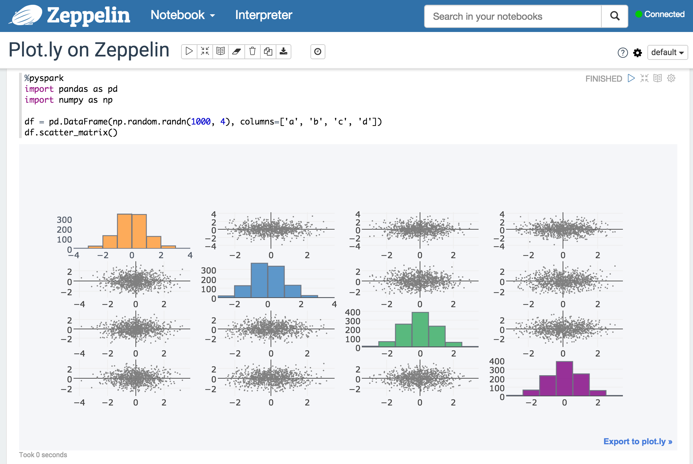

# Overview

[Apache Zeppelin](https://zeppelin.incubator.apache.org/) comes with basic charts out of the box and even offers the ability to call into the underlying NVD3 library. Sometimes, though, you just want some [Plot.ly](https://plot.ly/) goodness. While this awesome visualization library can be imported directly within Jupyter, having it work on Zeppelin needs a bit more of work. This repository is one way of making that happen.



It does two things:
* The Zeppelin web app sources `plotly-latest.min.js` from the CDN.
* It overrides Plot.ly's offline module with the code contained here such that calls to it will render via Zeppelin's display system instead of Jupyter's.

# Setup

These steps apply to the node that runs Zeppelin.

1. Install the following Python libraries:
	* [Plot.ly](https://plot.ly/python/getting-started/)
	* [Cufflinks](https://plot.ly/ipython-notebooks/cufflinks/)
	* [Pandas](http://pandas.pydata.org/)
	* [IPython](https://ipython.org/ipython-doc/2/install/install.html)

1. Clone this repository in a commonly accessible path.

1. Update `index.html` in zeppelin-web such that it sources `plotly-latest.min.js` during startup. The cleaner way would be to modify Zeppelin's code and then compile. But I assume you have already have Zeppelin set up and you just want to get Plot.ly running on it as fast as possible. In this case, we just extract `index.html` from `zeppelin-web-*.war`, insert the script tag for plotly.js, and then add `index.html` back into the same WAR file. 

  1. Find the `zeppelin-web-*.war` file inside the root folder of your Zeppelin install (i.e. `zeppelin-web-0.6.0-incubating-SNAPSHOT.war`). Back it up somewhere so you can restore the original copy if you need to.
  1. Extract `index.html`

      ```
      jar xvf zeppelin-web-0.6.0-incubating-SNAPSHOT.war index.html
      ```

  1. Edit `index.html` to insert `plotly-latest.min.js` script tag just before the `<body>` tag. 

      ```
      <link rel="stylesheet" ng-href="assets/styles/looknfeel/{{looknfeel}}.css"> <link rel="stylesheet" href="assets/styles/fontImport.css"> <script src="https://cdn.plot.ly/plotly-latest.min.js"></script> <body ng-class="{'bodyAsIframe': asIframe}">
      ```
  1. Insert this modified `index.html` back into the WAR file.

      ```
      jar uvf zeppelin-web-0.6.0-incubating-SNAPSHOT.war index.html
      ```

Your modifications to the setup are now done and you can just start or restart your Zeppelin instance. In case it fails to start, you probably mistyped something when editing `index.html`. You can always restore the original WAR file you backed up if all else fails.

# Usage

1. At the top of a Zeppelin notebook, copy and execute the following code. Replace with the actual path where you cloned the repository. 

    ```
    %pyspark
	# Load this module from a non-standard path (non-installed package)
    import sys
    sys.path.insert(0, "PATH_TO_YOUR_REPO/zeppelin-plotly")

    import offline

	# Override Plotly's module loading to use our patch instead.
    sys.modules["plotly"].offline = offline
    sys.modules["plotly.offline"] = offline

	# Import cufflinks (Pandas, etc) like usual.
    import cufflinks as cf

	# We need to use Cufflinks in offline mode.
    cf.go_offline()
    ```

1. You can then use Plotly and Cufflinks (offline mode) as usual in the suceeding notebook paragraphs.

    ```
    %pyspark
    import pandas as pd
    import numpy as np

    df = pd.DataFrame(np.random.randn(1000, 4), columns=['a', 'b', 'c', 'd'])
    df.scatter_matrix()
    ```

Check out the showcase notebook included inside the `sample` folder if you want to see the different visualizations available on Plot.ly. Just import the `json` file like how you would any other Zeppelin notebookand then point the `sys.path.insert` bit to the actual location of your cloned repo.

# TODO

* Maybe contribute this back to the Plot.ly and/or Zeppelin projects so that integration becomes even easier.
* Write tests

